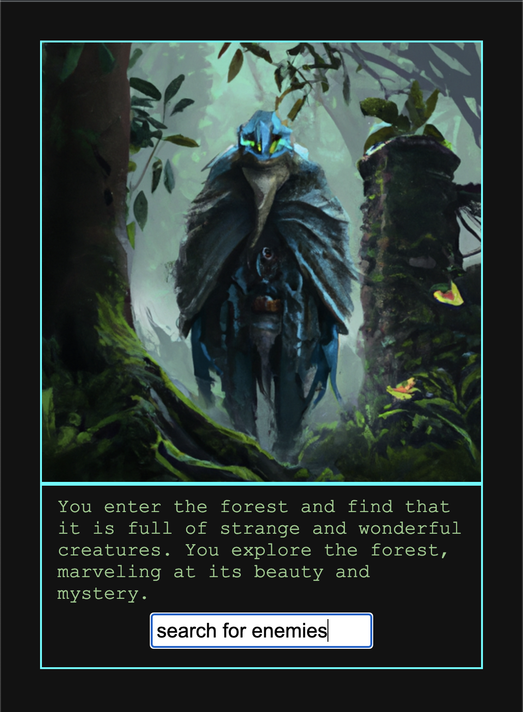
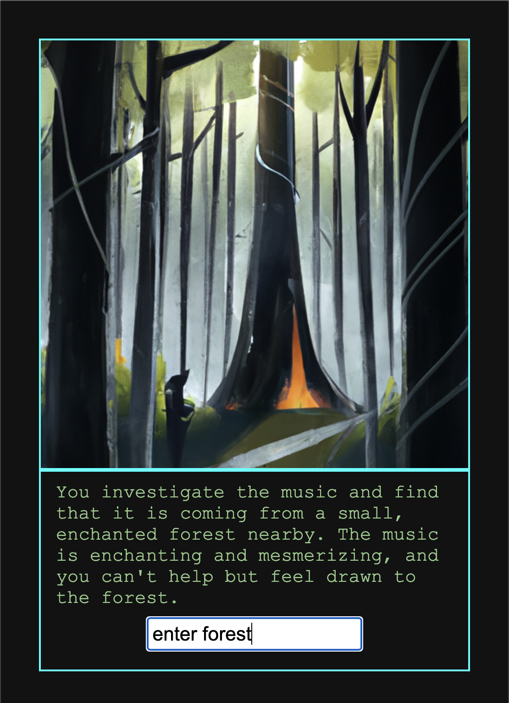
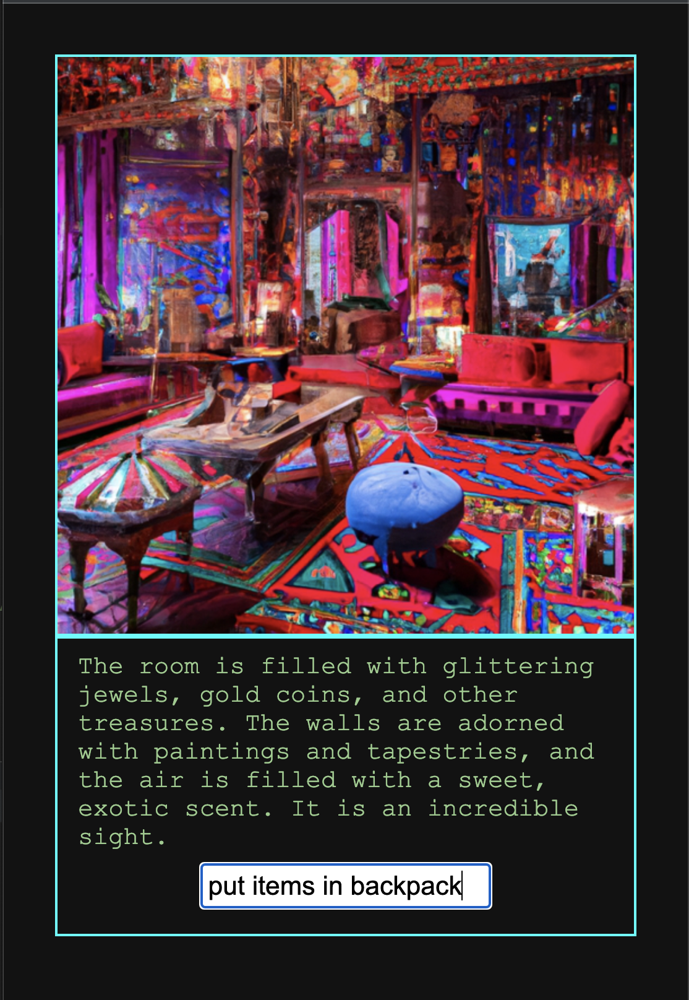
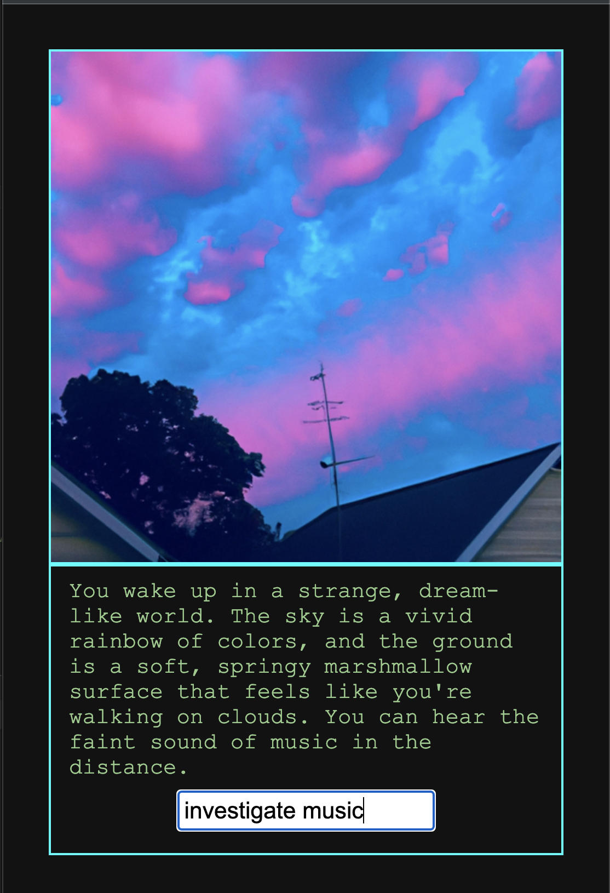

# Ephemerus

Procedural generated text & image based role playing game using ChatGPT & DallE.

Player input -> ChatGPT (text) -> DallE (image)

## Installation
```bash
git clone https://github.com/Matthew-Shannon/ephemerus.git && cd ephemerus && npm install

nano .env 
// paste config from below
BASE_URL="paste your ip here"
OPEN_AI_KEY="paste key here"
```

## How to Use?
Development setup
```bash
npm run develop
``` 
Server deployment
```bash
npm run server
```

## Screenshots

"server": "npx tsc && node dist/index.js",
"develop": "concurrently \"npx tsc --watch\" \"nodemon -q dist/index.js\""


<div style="display:flex">
     <div style="flex:1;padding-right:10px;">
           
          
     </div>
     <div style="flex:1;padding-left:10px;">
          
          
     </div>
</div>

## Contribute
mshannon93@gmail.com

## Credits
Matthew Shannon

## License
MIT License
